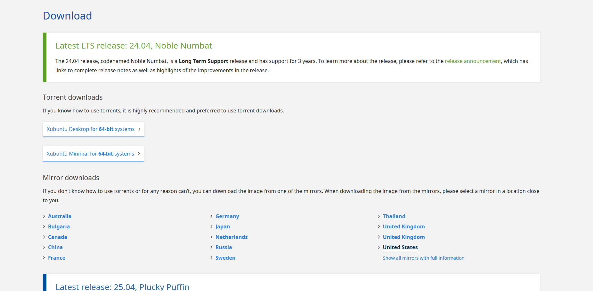
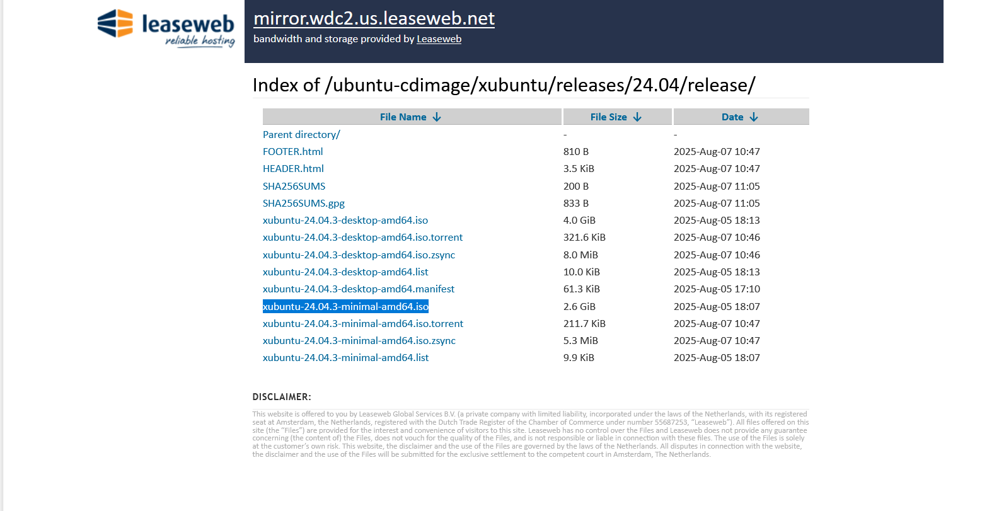
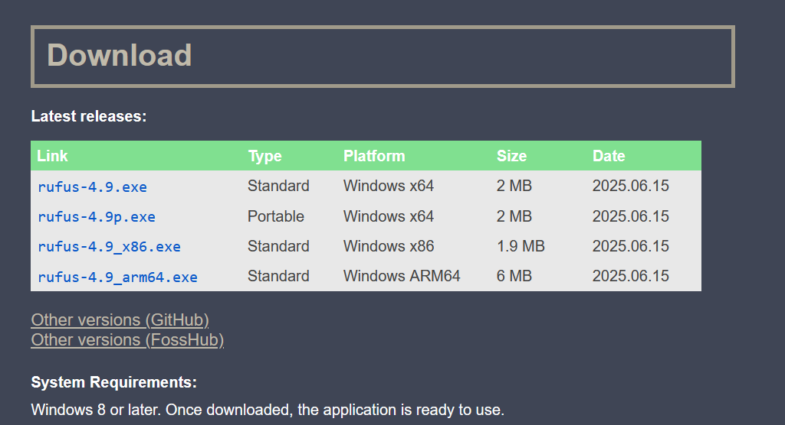

# Local Network (LAN-ONLY) "File-Server" Proect

---

### Description: In short - I wanted to create an on-prem, lan-only, file-share/sync/serve solution. I am not a traditional-tech, and with that said I wanted this "file-server" to have a graphical interface with additional abilities. As well, I did not want to PAY any money to BIG-TECH. I'd rather donate to the FOSS and alternative privacy/ security focused solutions on the market. 

---

## Tools OVerview: (Hardware + Software)
- Lenovo Laptop + Lenovo 300e + 8GB RAM + 128GB SSD | File-Server Device
- Xubuntu.iso + Rufus + USB Drive | Bootable Media Drive
- USB Drive (spare or reformat the bootable media drive) | Backup Recovery Drive

---

## Process Overview: (Frontend + Backend + Middle-Layer)
1. Frontend

    Static Site: Built with HTML + CSS

2. Backend

    Python HTTP Server: This service will serve the static site and handle the HTTP requests.

    Syncthing Service: This service will run in the background allowing other devices to share files to the file-server. 

    File Share/Sync/Serve Process: The full-process is built with scripts + crontab (jobs) to allow for automation. Ease of use. 

3. Manual Middle Layer

    Backup Recovery Process: (may require monitoring and configuration) - This full-process is built with scripts + crontab (jobs) + (backup) USB Drive. Could be considered a middle-layer.

    Automation Scripts: (may require monitoring and configuration) - These scripts automate tasks, we may need to update or adjust these scripts to align with folder-path renaming or relocation, etc. Could be considered a middle-layer.

---

## Step-by-Step:

### Disclaimer - These are the steps that I took for this project, that were successful for me using the device(s) and tool(s) outlined in the project. (The device I used for this project was a spare that I was willing to experiment with.) Please note that setting this up on a device improperly could lead to erasing your disk drive and potentially losing data. I will start with ALWAYS make sure you back up your data -- FIRST! I am not creating this project outline as a HOW-TO rather as a WHAT-I-DID outline...And be nice to your neighbor :D

1. **Locate and download Xubuntu** *(Linux XFCE distro)*
- **Link:** https://xubuntu.org/download/
- **Example View** - Scroll down below the Torrent Section and locat the Mirror Section. Dependent on your location and region - select what suits you. I will select and use the United States.
-   
- **Example View** - This is what the United States Mirror selection looks like. I will locae the Xubuntu-Minimal for 64-bit iso to select and download. **(xubuntu-24.04.3-minimal-amd64.iso)**
- 

2. **Locate and download Rufus** *(bootable media builder tool)*
- **Link:** https://rufus.ie/en/
- **Example View** - Select the latest release or go to GitHub or FossHub for previous versions
- 

3. **Install Rufus on our Windows Device**
We will need to (execute) the Rufus.exe to install the bootable media builder tool. Walk through the prompts for installation. Note: Please ensure that your system meets the minimal system requirements. (Notated in the image under Rufus)

4. **Prepare USB Drive**
Connect your USB drive to the Windows device, and make sure the drive is empty or perform a reformat before beginning the process.
- Connect to Windows Device
- Open File Explorer
- Right-Click on the USB Drive > Select Format
- Format Dialog Window > Quick Format
- Complete

5. **Create a bootable media USB Drive**
With the USB still connected to the device, we will open the Rufus Tool. Once the tool loads we will setup our configuration fields to create the bootable drive.
- Device Field - Select the USB Drive connected to the device. **(CONFIRM CORRECT SELECTION)**
- Boot Selection Field - Select **Disk or USB**
- Select Dropdown Field - Select to open the file-browser, then select the Xubunut.
